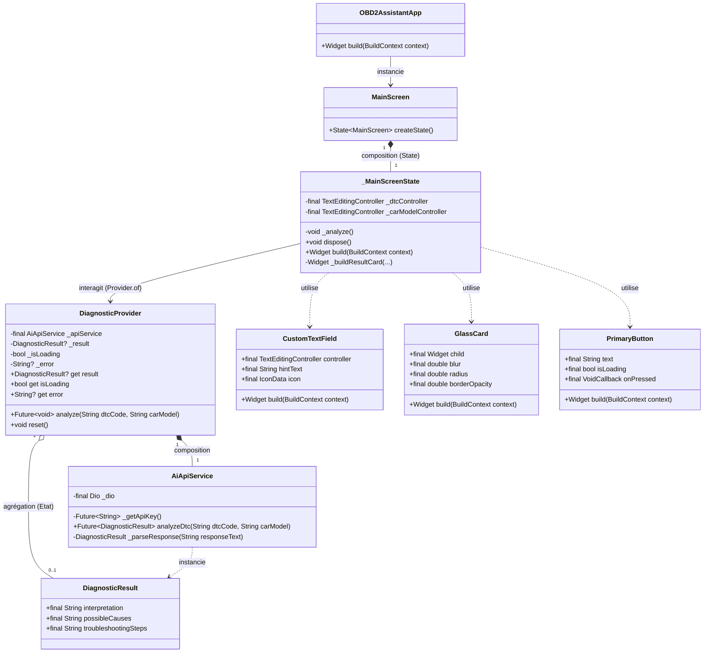

# Diagramme UML - Smart OBD2 Diagnostic Assistant

Ce document présente le diagramme de classes UML de l'application Flutter `obd2_assistant`. L'architecture suit une approche par composants structurée en couches (Data, Domain, Presentation).

## Diagramme de Classes

## Architecture Structurée

1. **Domain (Entités)** : 
   `DiagnosticResult` représente le modèle de données pur de l'application, indépendant du framework Flutter et des sources de données externes.
2. **Data (Services)** : 
   `AiApiService` gère la communication avec l'API Groq (via `Dio`) et récupère la clé API de façon sécurisée (via `Firebase Remote Config`).
3. **Presentation (Providers)** : 
   `DiagnosticProvider` sert de lien logique entre l'UI et les données. Utilisant `ChangeNotifier`, il expose les états de chargement (`isLoading`), les erreurs (`error`) et les résultats (`result`).
4. **Presentation (UI)** : 
   La vue principale `MainScreen` regroupe l'IHM et s'abonne à `DiagnosticProvider` pour se réafficher de manière réactive. Des composants visuels réutilisables (`GlassCard`, `CustomTextField`, `PrimaryButton`) y sont employés pour maintenir le style "Glassmorphism".
